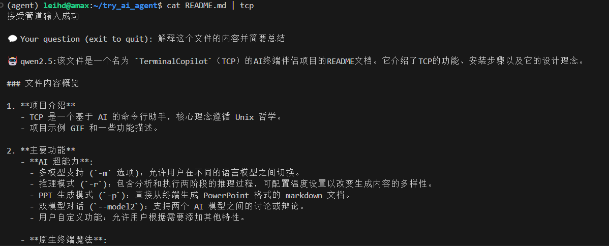

<div align='center'>
<h1>TCP: TerminalCopilot 🤖⌨️</h1h1>
<h3></h3>

[中文版本](https://github.com/bingyang-lei/TerminalCopilot/blob/main/README_zh.md)
</div>

Your AI-powered command line companion.
(Actually this README is mostly written by TCP)


Built with **Unix philosophy** at its core, you can pass any content by pipeline.


(To be honest, I admit this README is a little showy, and there are many features of TCP that need to be added or improved🥺, but ai feels this project good)
## 🌟 Features That Will Blow Your Terminal Away

### **AI Superpowers**
- 🧠 **Multi-Model Mastery**  
  `-m qwen2.5` | `--model deepseek-r1:32b`  
  Switch between cutting-edge LLMs like changing shells
- 🕵️ **Reasoning Mode** (`-r`)  
  Two-stage critical thinking:  
  `Analyze → Execute` with different temperature settings
- 💼 **PPT Gen Mode** (`-p`)  
  Create presentation-ready markdown in terminal
- 🎭 **Dual Model Dialogues**  
  `--model2 llama3.1:8b` for model vs model debates
- 🛠️ **Adding any other features by your own**
  Build your personalized AI assistant based on TCP

### **Terminal Native Magic**
- 🛠️ **Pipeline Power**  
  ```bash
  ls -la | tcp -m qwen2.5 "Explain these file permissions"
  man grep | tcp -r "Summarize key flags"
  ```
- 🔄 **Conversation Mode** (`-t`)  
  ```bash
  tcp -t "Debug this Python script" 5
  ```
- 📜 **Context-Aware**  
  Maintains session history like your favorite shell

## 🚀 Installation 

**Prerequisites**: Python 3.9+, [Ollama](https://ollama.ai/) running

```bash
# Clone with speed
git clone https://github.com/bingyang-lei/TerminalCopilot.git && cd TerminalCopilot

# Install dependencies (virtualenv recommended)
pip install -r requirements.txt

# Start your AI engine
ollama serve &  # Keep running in background

# Pull models you like
ollama pull qwen2.5 deepseek-r1:32b

# (Optional) set alias
echo 'alias tcp="python /yourpath/main.py"' >> ~/.bashrc
source ~/.bashrc
```

## 💡 Why tcp?

### **Unix Philosophy Embodied**

```bash
# Chain with classic tools
find . -name "*.py" | tcp -r "Analyze code patterns"
netstat -tulpn | tcp "Explain these network connections"
man sh | tcp "Give me a more friendly manual"
```
---

<!-- **Made with ❤️ for terminal warriors**  
[Contribute](#) | [Docs](#) | [Sponsor](#) -->
